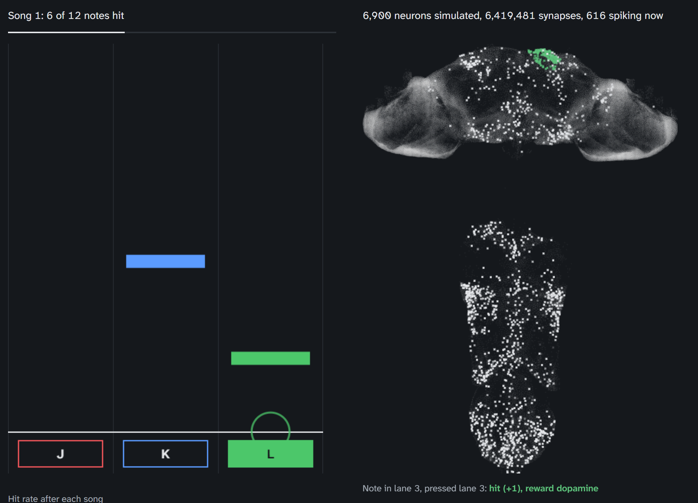

# Fly Hero

A spiking model of a real fruit fly brain learns a three-lane rhythm game by trial and error. The learning happens inside the simulated brain: dopamine strengthens the synapses that led to a hit and weakens the ones that led to a mistake.

**Live demo: [bsgelman.github.io/fly-hero](https://bsgelman.github.io/fly-hero/)**

**32% of notes hit before practice, 99.6% after 30 songs, and 100% on a song it never heard.** With its dopamine neurons blocked, it stays at 35%.



The simulation has 6,900 neurons (3,275 in the brain and 3,625 in the nerve cord) and 6,419,481 synapses from the Janelia and Google male fruit fly connectome. Every neuron that fires flashes on the brain view as it happens, all the way down the nerve cord.

## How it works

```
Janelia/Google male CNS connectome (public data)
   │
   ▼  extract_subgraph.py   connectome  →  6,900 neurons, 6,419,481 synapses
   ▼  sim.js                synapses    →  spiking neurons, 1 ms steps
   ▼  game.js               notes       →  the eye neurons for that lane fire
   ▼  agents.js             spikes      →  key press, reward, dopamine, synapse update
   ▼  app.js, brain.js      state       →  game, brain view and charts in the browser
```

| File | Lines | Job |
|---|--:|---|
| `tools/extract_subgraph.py` | 126 | Picks the eye, memory, dopamine, output and nerve cord neurons from the male CNS and writes the network |
| `js/sim.js` | 162 | Leaky integrate-and-fire neurons on the real synapse list, plus the shuffled and random wiring controls |
| `js/game.js` | 62 | Songs, rewards and a millisecond-level game loop |
| `js/agents.js` | 102 | Bio-RL (dopamine learning inside the brain) and Deep-RL (a trained readout) |
| `js/app.js` | 285 | The page: watch the fly learn, you vs fly, compare learners |
| `js/brain.js` | 53 | Brain and nerve cord drawing |
| `tools/run_experiments.mjs` | 68 | Runs every learner and control and writes `data/results.json` |
| `tools/train_fly.mjs` | 23 | Trains the fly you play against |
| `tools/test.mjs` | 69 | Checks for the neuron model, wiring controls, rewards and learning |

No frameworks, no build step and no npm packages. The same modules run in Node for the experiments and in the browser for the page.

## Results

Each learner practised for 30 songs (the same song 30 times), repeated 5 times from scratch. Scores are the share of notes hit.

| Learner | Before practice | End of practice | New song |
|---|--:|--:|--:|
| **Bio-RL, real wiring** | 31.9% | **99.6%** | **100.0%** |
| Bio-RL, shuffled wiring | 21.9% | 21.9% | 26.7% |
| Bio-RL, random network | 15.0% | 26.3% | 25.6% |
| Bio-RL, dopamine blocked | 30.0% | 35.3% | 37.9% |
| Deep-RL, real wiring | 23.1% | 98.9% | 97.9% |
| Deep-RL, shuffled wiring | 23.1% | 80.0% | 72.8% |
| Deep-RL, random network | 23.1% | 100.0% | 100.0% |
| Deep-RL, real wiring, 150 songs | 21.9% | 99.8% | 97.4% |

End of practice is the average of songs 26 to 30 (146 to 150 for the last row). New song is a different song, played once with learning switched off.

- **Dopamine does the learning.** With it blocked, the brain-style learner stays at 35%.
- **The brain-style learner needs the real wiring.** On shuffled wiring it stays at 22%, and on a random network at 26%. Shuffling makes the network fire out of control, so the fly presses on almost every beat; a random network barely passes the eyes' signal to the output neurons.
- **A trained readout doesn't.** Deep-RL learns from almost any spiking activity: 98.9% on the real wiring, 80.0% on shuffled wiring and 100% on a random network.
- **On the real wiring the two learners are tied.** Bio-RL passed 80% by song 3 to 5 on every run, and Deep-RL by song 4 or 5. Five times the practice (150 songs) didn't change Deep-RL (99.8%).

Full numbers, spreads and the reasoning behind each control are in [docs/lab-notebook.md](docs/lab-notebook.md).

## Design notes

**It reads notes instead of memorising the song.** The fly only sees which lane a note is in, never where it is in the song. That is why it scores the same on a song it never practised.

**Dopamine is made of simulated spikes.** After each press, reward (PAM) or punishment (PPL1) dopamine neurons fire in proportion to how surprising the result was, and their spike counts set how much the synapses change. Blocking dopamine silences those neurons, and learning stops.

**Mistakes can't wipe out what it learned.** Simple dopamine rules often fail because early mistakes far outnumber hits. Here a change shrinks to zero once a pathway already predicts its reward, only synapses that just fired can change, waiting changes nothing, and synapse strength is capped.

**One fly for everything.** The wiring, the sign of every synapse, the drawing and each neuron's position all come from the Janelia and Google male CNS connectome, so every flash is at that neuron's own cell body.

**The nerve cord fires too.** 3,625 nerve cord neurons receive the brain's descending neurons, so activity travels down the neck when the fly acts. The cord only listens: nothing flows back into the brain, and the wiring controls leave it untouched. Replaying runs with and without it gave identical key presses.

**Settings were fixed before the results.** Every learner and control runs through the same code with the same parameters, set once before the experiments.

## Limitations

Each note is a single decision, so this is reward prediction error learning, not learning over long sequences. In real flies, dopamine mostly weakens these synapses, while here reward strengthens them. Dopamine reaches the whole memory centre at once rather than individual compartments. Only the right half of the brain is simulated, and the nerve cord only receives signals from the brain.

## Running it

```bash
git clone https://github.com/bsgelman/fly-hero.git
cd fly-hero
python tools/serve.py
```

Open http://localhost:8766.

- **Watch the fly learn:** pick a learner and wiring, and watch its hit rate climb song by song.
- **You vs fly:** play the same song with J, K and L against a fly that has practised it 30 times.
- **Compare learners:** every learner and control on one chart, with a plain-language guide.

```bash
node tools/test.mjs              # checks, about 10 s
node tools/run_experiments.mjs   # every learner and control, about 25 min
node tools/train_fly.mjs         # retrains the You vs fly opponent
```

To rebuild the network from the raw connectome, download three files from the [Janelia male CNS downloads](https://male-cns.janelia.org/download/) into `data/raw/` and run `python tools/extract_subgraph.py` (needs pandas and pyarrow):

- `body-annotations-male-cns-v1.0-minconf-0.5.feather`, saved as `mcns_annotations.feather`
- `connectome-weights-male-cns-v1.0-minconf-0.5.feather`, saved as `mcns_weights.feather` (about 1 GB)
- `body-neurotransmitters-male-cns-v1.0.feather`, saved as `mcns_neurotransmitters.feather`

## Based on published research

- **Neuron model:** Shiu et al., [Nature 2024](https://doi.org/10.1038/s41586-024-07763-9).
- **Brain wiring, cell types and drawing:** the male fruit fly connectome (male CNS v1.0), released open source by Janelia Research Campus, Google Research, the University of Cambridge and the MRC Laboratory of Molecular Biology. Berg et al., [Cell 2026](https://doi.org/10.1016/j.cell.2026.08.015). [Data](https://male-cns.janelia.org/) (CC-BY) and [Google Research announcement](https://research.google/blog/a-connectomics-milestone-mapping-the-complete-male-fruit-fly-brain/).
- **Dopamine learning rule:** inspired by Bennett, Philippides and Nowotny, [Nature Communications 2021](https://doi.org/10.1038/s41467-021-22592-4).

## License

Code is under the MIT License. The network and brain positions are derived from the Janelia and Google male CNS data (CC-BY), credited above. The typeface is Atkinson Hyperlegible Next under the SIL Open Font License (`fonts/OFL.txt`).
